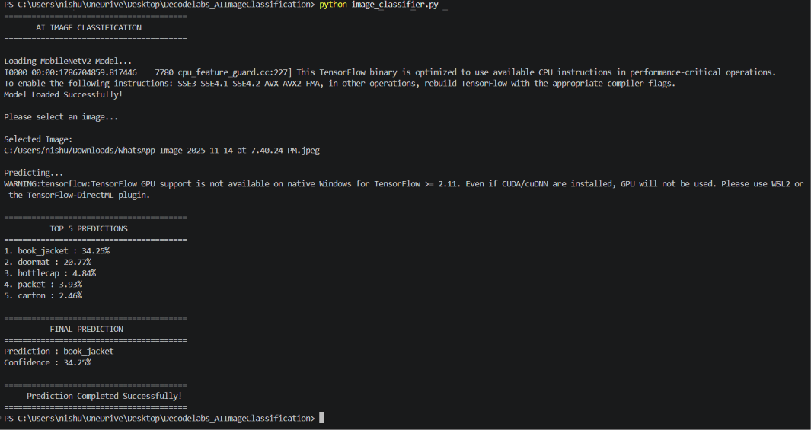

# 🖼️ AI Image Classification

A basic image classification project developed in Python as part of DecodeLabs Artificial Intelligence Project 4.

## 📌 About the Project

This project demonstrates image classification using a pre-trained deep learning model.

The system uses **MobileNetV2**, a model trained on the **ImageNet** dataset, to analyze a user-selected image and identify the most likely objects or categories present in the image.

The program allows the user to select an image from their computer and then displays the top five predictions along with their confidence scores.

## 🎯 Project Objectives

- Load a pre-trained image classification model
- Allow the user to select an image
- Preprocess the selected image
- Use MobileNetV2 to classify the image
- Display the top five predictions
- Display the highest-confidence prediction
- Show the confidence score for the final prediction

## 🧠 Technologies Used

- Python
- TensorFlow
- NumPy
- Matplotlib
- Tkinter
- MobileNetV2
- ImageNet

## 🤖 AI Model

The project uses **MobileNetV2** with pre-trained ImageNet weights.

MobileNetV2 is used to classify images into categories learned from the ImageNet dataset.

The model processes the selected image and returns the most likely classifications.

## ⚙️ Image Classification Process

```text
Select Image
      ↓
Load Image
      ↓
Resize Image to 224 × 224
      ↓
Convert Image to Array
      ↓
Preprocess Image
      ↓
MobileNetV2 Model
      ↓
Generate Predictions
      ↓
Get Top 5 Predictions
      ↓
Display Final Prediction
```

## 🔍 Prediction Results

For each selected image, the program displays:

- Top 5 predicted categories
- Confidence percentage for each prediction
- Final prediction
- Confidence score of the final prediction

## 📊 Sample Result

For the test image used during development, the model produced:

```text
1. book_jacket : 34.25%
2. doormat : 20.77%
3. bottlecap : 4.84%
4. packet : 3.93%
5. carton : 2.46%

Prediction : book_jacket
Confidence : 34.25%

## 📸 Demo

Here is the AI Image Classification system running in the terminal:



## ▶️ How to Run

### 1. Install the required libraries

```bash
pip install tensorflow numpy matplotlib
```

### 2. Run the program

```bash
python image_classifier.py
```

### 3. Select an image

A file-selection window will appear.

Choose a `.jpg`, `.jpeg`, or `.png` image.

The program will then analyze the image and display the top five predictions.

## 📋 Example Output

```text
========================================
       AI IMAGE CLASSIFICATION
========================================

Loading MobileNetV2 Model...
Model Loaded Successfully!

Please select an image...

========================================
          TOP 5 PREDICTIONS
========================================

1. limousine : 30.91%
2. beach_wagon : 25.63%
3. minivan : 9.39%
4. convertible : 3.43%
5. jeep : 1.93%

========================================
          FINAL PREDICTION
========================================

Prediction : limousine
Confidence : 30.91%
```

## ⚠️ Note

The predictions are generated by a pre-trained model and represent the model's confidence in the available ImageNet categories. The highest-confidence prediction is not guaranteed to be the correct interpretation of every image.
